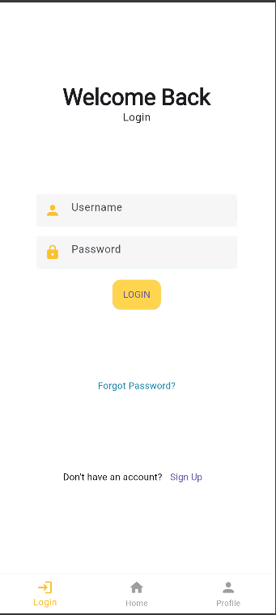
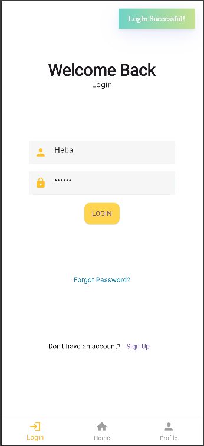
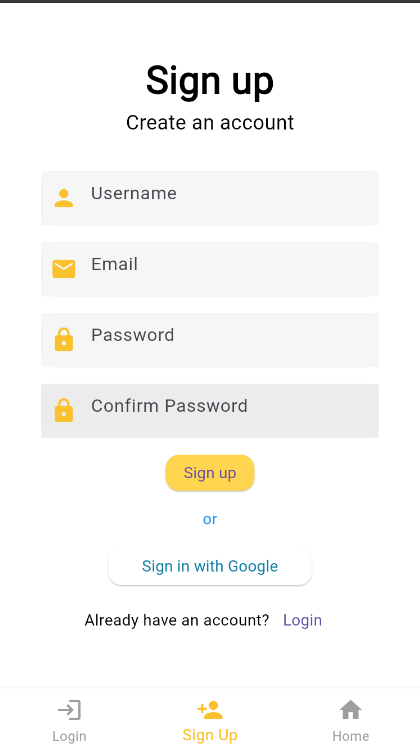
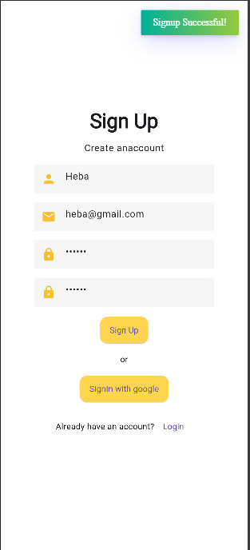
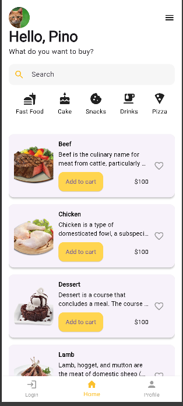

# Basic Flutter App

A clean Flutter project that demonstrates a modern login and sign-up UI, along with a dynamic home screen that fetches a list of food categories from a public API.

## ✨ Features

- Login screen with validation and SnackBar/Toast feedback  
- Sign-up screen with matching clean UI  
- TextFormField inputs wrapped in a reusable widget (`AppTextField`)  
- **Consistent app-wide theming** using `ThemeData` and a centralized `AppTheme`  
- Color palette extracted into `AppColors` for easy reuse  
- Home screen that fetches and displays food categories from the network  
- Bottom navigation bar to switch between Home, Login, and **Profile (replacing Signup)**  
- **Profile screen** added and is currently under development  
- **Bloc state management** implemented for Login and Signup workflows

## 🧠 State Management

This app uses the **Bloc (Business Logic Component)** pattern for state management:
- Handles form validation and UI state changes efficiently  
- Bloc logic is separated for Login and Signup (`login_bloc`, `signup_bloc`)  
- Emits loading, success, and failure states for better user feedback and flow control  

## 🎨 Theming

The app applies global theming using `ThemeData` inside `MaterialApp`, customizing:
- AppBar color
- Input decoration themes
- Text styles via `TextTheme`
- Button styling

You can control these globally from `utils/app_themes.dart` and reuse shared colors from `utils/app_colors.dart`.

## 🌐 API Integration

The home screen uses a real API — [TheMealDB](https://www.themealdb.com/api.php) — to fetch and display food categories.  
Each list item includes:
- A thumbnail image
- Category title
- A brief description

> 💡 This is like a past project I did using dummy json API that I previously worked with in a JavaScript project. This time, I integrated it using Dart and the `http` package in Flutter.

## 📸 Screenshots

### 🔐 Login Screen
  


### 📝 Sign Up Screen
  


### 🏠 Home Screen
  


## 🚀 Getting Started

To run this project on your machine:

1. **Clone the repository:**
   ```sh
   git clone <your-repo-url>
   cd hello_world
````

2. **Install dependencies:**

   ```sh
   flutter pub get
   ```

3. **Run the app:**

   ```sh
   flutter run
   ```

## 📦 Dependencies Used

| Package                                                 | Purpose                                |
| ------------------------------------------------------- | -------------------------------------- |
| [`http`](https://pub.dev/packages/http)                 | For making API requests                |
| [`flutter_bloc`](https://pub.dev/packages/flutter_bloc) | Bloc state management                  |
| [`fluttertoast`](https://pub.dev/packages/fluttertoast) | Displaying toast messages for feedback |

## 🛠️ Folder Structure

```
lib/
├── main.dart
├── auth/
│   ├── auth/
│       ├── login_bloc/
|            ├── login_bloc.dart
|            ├── login_event.dart
|            ├── login_state.dart
│       ├── signup_bloc/
|            ├── signup_bloc.dart
|            ├── signup_event.dart
|            ├── signup_state.dart
├── utils/
│   ├── app_colors.dart
│   ├── app_themes.dart
│   ├── my_flutter_app_icons.dart
│   ├── login_form_validator.dart
│   ├── signup_form_validator.dart
├── views/
│   ├── profile_screen.dart   # under development
│   ├── login_screen.dart
│   ├── signin_screen.dart
│   ├── home_screen.dart
│   └── main_navigation.dart
├── widgets/
│   ├── app_text_form_field.dart
```

## 📚 Resources

* [Flutter Documentation](https://docs.flutter.dev/)
* [Lab: Write your first Flutter app](https://docs.flutter.dev/get-started/codelab)
* [Cookbook: Useful Flutter samples](https://docs.flutter.dev/cookbook)

## 🔓 License

This project is for educational purposes and does not include a license.
Feel free to use and modify for your own learning.

---

**Tip:**
For best results, use the official Android Emulator or Genymotion.

